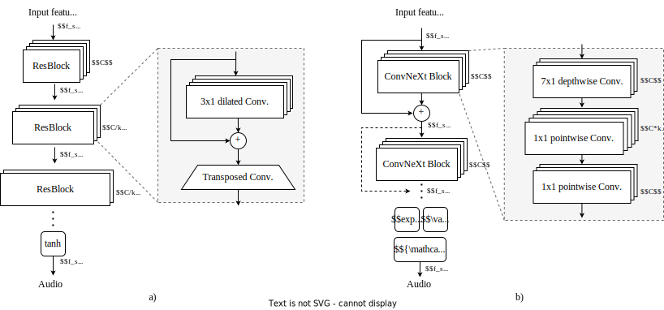

# Vocos: Closing the gap between time-domain and Fourier-based neural vocoders for high-quality audio synthesis

Author: Hubert Siuzdak

Paper: [arXiv](https://arxiv.org/abs/2306.00814)\
Code: [GitHub](https://github.com/charactr-platform/vocos)

---

## Updates
### 2023-06-12
Added examples generated with Bark text-to-audio model. Check them out [here](#audio-reconstruction-from-bark-tokens).

---

> **Abstract**
> Recent advancements in neural vocoding are predominantly driven by Generative Adversarial Networks (GANs) operating in
> the time-domain. While effective, this approach neglects the inductive bias offered by time-frequency representations,
> resulting in reduntant and computionally-intensive upsampling operations. Fourier-based time-frequency representation
> is
> an appealing alternative, aligning more accurately with human auditory perception, and benefitting from
> well-established
> fast algorithms for its computation. Nevertheless, direct reconstruction of complex-valued spectrograms has been
> historically problematic, primarily due to phase recovery issues. This study seeks to close this gap by presenting
> Vocos, a new model that addresses the key challenges of modeling spectral coefficients. Vocos demonstrates improved
> computational efficiency, achieving an order of magnitude increase in speed compared to prevailing time-domain neural
> vocoding approaches. As shown by objective evaluation, Vocos not only matches state-of-the-art audio quality, but
> thanks
> to frequency-aware generator, also effectively mitigates the periodicity issues frequently associated with time-domain
> GANs. The source code and model weights have been open-sourced at https://github.com/charactr-platform/vocos.

---

Figure 1: Comparison of a typical time-domain GAN vocoder (a), with the proposed Vocos architecture (b) that maintains
the same temporal resolution across all layers. Time-domain vocoders use transposed convolutions to sequentially
upsample the signal to the desired sample rate. In contrast, Vocos achieves this by using a computationally efficient
inverse Fourier transform.

### Resynthesis from neural audio codec (EnCodec)

#### 1.5 kbps

<table>
  <tr>
    <th>Ground truth</th>
    <th>EnCodec</th>
    <th>Vocos</th>
  </tr>
  <tr>
    <td><audio controls preload="none"><source src="audio/encodec/gt/m2_script2_cleanraw_trimmed_008.mp3" type="audio/mp3">Your browser does not support the audio element.</audio></td>
    <td><audio controls preload="none"><source src="audio/encodec/1.5kbps/encodec/m2_script2_cleanraw_trimmed_008.mp3" type="audio/mp3">Your browser does not support the audio element.</audio> </td>
    <td><audio controls preload="none"><source src="audio/encodec/1.5kbps/vocos/m2_script2_cleanraw_trimmed_008.mp3" type="audio/mp3">Your browser does not support the audio element.</audio></td>
  </tr>
  <tr>
    <td><audio controls preload="none"><source src="audio/encodec/gt/f10_script1_cleanraw_trimmed_002.mp3" type="audio/mp3">Your browser does not support the audio element.</audio></td>
    <td><audio controls preload="none"><source src="audio/encodec/1.5kbps/encodec/f10_script1_cleanraw_trimmed_002.mp3" type="audio/mp3">Your browser does not support the audio element.</audio> </td>
    <td><audio controls preload="none"><source src="audio/encodec/1.5kbps/vocos/f10_script1_cleanraw_trimmed_002.mp3" type="audio/mp3">Your browser does not support the audio element.</audio></td>
  </tr>
  <tr>
    <td><audio controls preload="none"><source src="audio/encodec/gt/m3_script3_cleanraw_trimmed_016.mp3" type="audio/mp3">Your browser does not support the audio element.</audio></td>
    <td><audio controls preload="none"><source src="audio/encodec/1.5kbps/encodec/m3_script3_cleanraw_trimmed_016.mp3" type="audio/mp3">Your browser does not support the audio element.</audio> </td>
    <td><audio controls preload="none"><source src="audio/encodec/1.5kbps/vocos/m3_script3_cleanraw_trimmed_016.mp3" type="audio/mp3">Your browser does not support the audio element.</audio></td>
  </tr>
  <tr>
    <td><audio controls preload="none"><source src="audio/encodec/gt/f9_script5_cleanraw_trimmed_010.mp3" type="audio/mp3">Your browser does not support the audio element.</audio></td>
    <td><audio controls preload="none"><source src="audio/encodec/1.5kbps/encodec/f9_script5_cleanraw_trimmed_010.mp3" type="audio/mp3">Your browser does not support the audio element.</audio> </td>
    <td><audio controls preload="none"><source src="audio/encodec/1.5kbps/vocos/f9_script5_cleanraw_trimmed_010.mp3" type="audio/mp3">Your browser does not support the audio element.</audio></td>
  </tr>
  <tr>
    <td><audio controls preload="none"><source src="audio/encodec/gt/m4_script4_cleanraw_trimmed_005.mp3" type="audio/mp3">Your browser does not support the audio element.</audio></td>
    <td><audio controls preload="none"><source src="audio/encodec/1.5kbps/encodec/m4_script4_cleanraw_trimmed_005.mp3" type="audio/mp3">Your browser does not support the audio element.</audio> </td>
    <td><audio controls preload="none"><source src="audio/encodec/1.5kbps/vocos/m4_script4_cleanraw_trimmed_005.mp3" type="audio/mp3">Your browser does not support the audio element.</audio></td>
  </tr>
  <tr>
    <td><audio controls preload="none"><source src="audio/encodec/gt/f7_script3_cleanraw_trimmed_008.mp3" type="audio/mp3">Your browser does not support the audio element.</audio></td>
    <td><audio controls preload="none"><source src="audio/encodec/1.5kbps/encodec/f7_script3_cleanraw_trimmed_008.mp3" type="audio/mp3">Your browser does not support the audio element.</audio> </td>
    <td><audio controls preload="none"><source src="audio/encodec/1.5kbps/vocos/f7_script3_cleanraw_trimmed_008.mp3" type="audio/mp3">Your browser does not support the audio element.</audio></td>
  </tr>
  <tr>
    <td><audio controls preload="none"><source src="audio/encodec/gt/m7_script4_cleanraw_trimmed_003.mp3" type="audio/mp3">Your browser does not support the audio element.</audio></td>
    <td><audio controls preload="none"><source src="audio/encodec/1.5kbps/encodec/m7_script4_cleanraw_trimmed_003.mp3" type="audio/mp3">Your browser does not support the audio element.</audio> </td>
    <td><audio controls preload="none"><source src="audio/encodec/1.5kbps/vocos/m7_script4_cleanraw_trimmed_003.mp3" type="audio/mp3">Your browser does not support the audio element.</audio></td>
  </tr>
  <tr>
    <td><audio controls preload="none"><source src="audio/encodec/gt/f5_script1_cleanraw_trimmed_015.mp3" type="audio/mp3">Your browser does not support the audio element.</audio></td>
    <td><audio controls preload="none"><source src="audio/encodec/1.5kbps/encodec/f5_script1_cleanraw_trimmed_015.mp3" type="audio/mp3">Your browser does not support the audio element.</audio> </td>
    <td><audio controls preload="none"><source src="audio/encodec/1.5kbps/vocos/f5_script1_cleanraw_trimmed_015.mp3" type="audio/mp3">Your browser does not support the audio element.</audio></td>
  </tr>
</table> 

#### 3 kbps

<table>
  <tr>
    <th>Ground truth</th>
    <th>EnCodec</th>
    <th>Vocos</th>
  </tr>
  <tr>
    <td><audio controls preload="none"><source src="audio/encodec/gt/m2_script2_cleanraw_trimmed_008.mp3" type="audio/mp3">Your browser does not support the audio element.</audio></td>
    <td><audio controls preload="none"><source src="audio/encodec/3kbps/encodec/m2_script2_cleanraw_trimmed_008.mp3" type="audio/mp3">Your browser does not support the audio element.</audio> </td>
    <td><audio controls preload="none"><source src="audio/encodec/3kbps/vocos/m2_script2_cleanraw_trimmed_008.mp3" type="audio/mp3">Your browser does not support the audio element.</audio></td>
  </tr>
  <tr>
    <td><audio controls preload="none"><source src="audio/encodec/gt/f10_script1_cleanraw_trimmed_002.mp3" type="audio/mp3">Your browser does not support the audio element.</audio></td>
    <td><audio controls preload="none"><source src="audio/encodec/3kbps/encodec/f10_script1_cleanraw_trimmed_002.mp3" type="audio/mp3">Your browser does not support the audio element.</audio> </td>
    <td><audio controls preload="none"><source src="audio/encodec/3kbps/vocos/f10_script1_cleanraw_trimmed_002.mp3" type="audio/mp3">Your browser does not support the audio element.</audio></td>
  </tr>
  <tr>
    <td><audio controls preload="none"><source src="audio/encodec/gt/m3_script3_cleanraw_trimmed_016.mp3" type="audio/mp3">Your browser does not support the audio element.</audio></td>
    <td><audio controls preload="none"><source src="audio/encodec/3kbps/encodec/m3_script3_cleanraw_trimmed_016.mp3" type="audio/mp3">Your browser does not support the audio element.</audio> </td>
    <td><audio controls preload="none"><source src="audio/encodec/3kbps/vocos/m3_script3_cleanraw_trimmed_016.mp3" type="audio/mp3">Your browser does not support the audio element.</audio></td>
  </tr>
  <tr>
    <td><audio controls preload="none"><source src="audio/encodec/gt/f9_script5_cleanraw_trimmed_010.mp3" type="audio/mp3">Your browser does not support the audio element.</audio></td>
    <td><audio controls preload="none"><source src="audio/encodec/3kbps/encodec/f9_script5_cleanraw_trimmed_010.mp3" type="audio/mp3">Your browser does not support the audio element.</audio> </td>
    <td><audio controls preload="none"><source src="audio/encodec/3kbps/vocos/f9_script5_cleanraw_trimmed_010.mp3" type="audio/mp3">Your browser does not support the audio element.</audio></td>
  </tr>
  <tr>
    <td><audio controls preload="none"><source src="audio/encodec/gt/m4_script4_cleanraw_trimmed_005.mp3" type="audio/mp3">Your browser does not support the audio element.</audio></td>
    <td><audio controls preload="none"><source src="audio/encodec/3kbps/encodec/m4_script4_cleanraw_trimmed_005.mp3" type="audio/mp3">Your browser does not support the audio element.</audio> </td>
    <td><audio controls preload="none"><source src="audio/encodec/3kbps/vocos/m4_script4_cleanraw_trimmed_005.mp3" type="audio/mp3">Your browser does not support the audio element.</audio></td>
  </tr>
  <tr>
    <td><audio controls preload="none"><source src="audio/encodec/gt/f7_script3_cleanraw_trimmed_008.mp3" type="audio/mp3">Your browser does not support the audio element.</audio></td>
    <td><audio controls preload="none"><source src="audio/encodec/3kbps/encodec/f7_script3_cleanraw_trimmed_008.mp3" type="audio/mp3">Your browser does not support the audio element.</audio> </td>
    <td><audio controls preload="none"><source src="audio/encodec/3kbps/vocos/f7_script3_cleanraw_trimmed_008.mp3" type="audio/mp3">Your browser does not support the audio element.</audio></td>
  </tr>
  <tr>
    <td><audio controls preload="none"><source src="audio/encodec/gt/m7_script4_cleanraw_trimmed_003.mp3" type="audio/mp3">Your browser does not support the audio element.</audio></td>
    <td><audio controls preload="none"><source src="audio/encodec/3kbps/encodec/m7_script4_cleanraw_trimmed_003.mp3" type="audio/mp3">Your browser does not support the audio element.</audio> </td>
    <td><audio controls preload="none"><source src="audio/encodec/3kbps/vocos/m7_script4_cleanraw_trimmed_003.mp3" type="audio/mp3">Your browser does not support the audio element.</audio></td>
  </tr>
  <tr>
    <td><audio controls preload="none"><source src="audio/encodec/gt/f5_script1_cleanraw_trimmed_015.mp3" type="audio/mp3">Your browser does not support the audio element.</audio></td>
    <td><audio controls preload="none"><source src="audio/encodec/3kbps/encodec/f5_script1_cleanraw_trimmed_015.mp3" type="audio/mp3">Your browser does not support the audio element.</audio> </td>
    <td><audio controls preload="none"><source src="audio/encodec/3kbps/vocos/f5_script1_cleanraw_trimmed_015.mp3" type="audio/mp3">Your browser does not support the audio element.</audio></td>
  </tr>
</table> 

#### 6 kbps

<table>
  <tr>
    <th>Ground truth</th>
    <th>EnCodec</th>
    <th>Vocos</th>
  </tr>
  <tr>
    <td><audio controls preload="none"><source src="audio/encodec/gt/m2_script2_cleanraw_trimmed_008.mp3" type="audio/mp3">Your browser does not support the audio element.</audio></td>
    <td><audio controls preload="none"><source src="audio/encodec/6kbps/encodec/m2_script2_cleanraw_trimmed_008.mp3" type="audio/mp3">Your browser does not support the audio element.</audio> </td>
    <td><audio controls preload="none"><source src="audio/encodec/6kbps/vocos/m2_script2_cleanraw_trimmed_008.mp3" type="audio/mp3">Your browser does not support the audio element.</audio></td>
  </tr>
  <tr>
    <td><audio controls preload="none"><source src="audio/encodec/gt/f10_script1_cleanraw_trimmed_002.mp3" type="audio/mp3">Your browser does not support the audio element.</audio></td>
    <td><audio controls preload="none"><source src="audio/encodec/6kbps/encodec/f10_script1_cleanraw_trimmed_002.mp3" type="audio/mp3">Your browser does not support the audio element.</audio> </td>
    <td><audio controls preload="none"><source src="audio/encodec/6kbps/vocos/f10_script1_cleanraw_trimmed_002.mp3" type="audio/mp3">Your browser does not support the audio element.</audio></td>
  </tr>
  <tr>
    <td><audio controls preload="none"><source src="audio/encodec/gt/m3_script3_cleanraw_trimmed_016.mp3" type="audio/mp3">Your browser does not support the audio element.</audio></td>
    <td><audio controls preload="none"><source src="audio/encodec/6kbps/encodec/m3_script3_cleanraw_trimmed_016.mp3" type="audio/mp3">Your browser does not support the audio element.</audio> </td>
    <td><audio controls preload="none"><source src="audio/encodec/6kbps/vocos/m3_script3_cleanraw_trimmed_016.mp3" type="audio/mp3">Your browser does not support the audio element.</audio></td>
  </tr>
  <tr>
    <td><audio controls preload="none"><source src="audio/encodec/gt/f9_script5_cleanraw_trimmed_010.mp3" type="audio/mp3">Your browser does not support the audio element.</audio></td>
    <td><audio controls preload="none"><source src="audio/encodec/6kbps/encodec/f9_script5_cleanraw_trimmed_010.mp3" type="audio/mp3">Your browser does not support the audio element.</audio> </td>
    <td><audio controls preload="none"><source src="audio/encodec/6kbps/vocos/f9_script5_cleanraw_trimmed_010.mp3" type="audio/mp3">Your browser does not support the audio element.</audio></td>
  </tr>
  <tr>
    <td><audio controls preload="none"><source src="audio/encodec/gt/m4_script4_cleanraw_trimmed_005.mp3" type="audio/mp3">Your browser does not support the audio element.</audio></td>
    <td><audio controls preload="none"><source src="audio/encodec/6kbps/encodec/m4_script4_cleanraw_trimmed_005.mp3" type="audio/mp3">Your browser does not support the audio element.</audio> </td>
    <td><audio controls preload="none"><source src="audio/encodec/6kbps/vocos/m4_script4_cleanraw_trimmed_005.mp3" type="audio/mp3">Your browser does not support the audio element.</audio></td>
  </tr>
  <tr>
    <td><audio controls preload="none"><source src="audio/encodec/gt/f7_script3_cleanraw_trimmed_008.mp3" type="audio/mp3">Your browser does not support the audio element.</audio></td>
    <td><audio controls preload="none"><source src="audio/encodec/6kbps/encodec/f7_script3_cleanraw_trimmed_008.mp3" type="audio/mp3">Your browser does not support the audio element.</audio> </td>
    <td><audio controls preload="none"><source src="audio/encodec/6kbps/vocos/f7_script3_cleanraw_trimmed_008.mp3" type="audio/mp3">Your browser does not support the audio element.</audio></td>
  </tr>
  <tr>
    <td><audio controls preload="none"><source src="audio/encodec/gt/m7_script4_cleanraw_trimmed_003.mp3" type="audio/mp3">Your browser does not support the audio element.</audio></td>
    <td><audio controls preload="none"><source src="audio/encodec/6kbps/encodec/m7_script4_cleanraw_trimmed_003.mp3" type="audio/mp3">Your browser does not support the audio element.</audio> </td>
    <td><audio controls preload="none"><source src="audio/encodec/6kbps/vocos/m7_script4_cleanraw_trimmed_003.mp3" type="audio/mp3">Your browser does not support the audio element.</audio></td>
  </tr>
  <tr>
    <td><audio controls preload="none"><source src="audio/encodec/gt/f5_script1_cleanraw_trimmed_015.mp3" type="audio/mp3">Your browser does not support the audio element.</audio></td>
    <td><audio controls preload="none"><source src="audio/encodec/6kbps/encodec/f5_script1_cleanraw_trimmed_015.mp3" type="audio/mp3">Your browser does not support the audio element.</audio> </td>
    <td><audio controls preload="none"><source src="audio/encodec/6kbps/vocos/f5_script1_cleanraw_trimmed_015.mp3" type="audio/mp3">Your browser does not support the audio element.</audio></td>
  </tr>
</table> 

#### 12 kbps

<table>
  <tr>
    <th>Ground truth</th>
    <th>EnCodec</th>
    <th>Vocos</th>
  </tr>
  <tr>
    <td><audio controls preload="none"><source src="audio/encodec/gt/m2_script2_cleanraw_trimmed_008.mp3" type="audio/mp3">Your browser does not support the audio element.</audio></td>
    <td><audio controls preload="none"><source src="audio/encodec/12kbps/encodec/m2_script2_cleanraw_trimmed_008.mp3" type="audio/mp3">Your browser does not support the audio element.</audio> </td>
    <td><audio controls preload="none"><source src="audio/encodec/12kbps/vocos/m2_script2_cleanraw_trimmed_008.mp3" type="audio/mp3">Your browser does not support the audio element.</audio></td>
  </tr>
  <tr>
    <td><audio controls preload="none"><source src="audio/encodec/gt/f10_script1_cleanraw_trimmed_002.mp3" type="audio/mp3">Your browser does not support the audio element.</audio></td>
    <td><audio controls preload="none"><source src="audio/encodec/12kbps/encodec/f10_script1_cleanraw_trimmed_002.mp3" type="audio/mp3">Your browser does not support the audio element.</audio> </td>
    <td><audio controls preload="none"><source src="audio/encodec/12kbps/vocos/f10_script1_cleanraw_trimmed_002.mp3" type="audio/mp3">Your browser does not support the audio element.</audio></td>
  </tr>
  <tr>
    <td><audio controls preload="none"><source src="audio/encodec/gt/m3_script3_cleanraw_trimmed_016.mp3" type="audio/mp3">Your browser does not support the audio element.</audio></td>
    <td><audio controls preload="none"><source src="audio/encodec/12kbps/encodec/m3_script3_cleanraw_trimmed_016.mp3" type="audio/mp3">Your browser does not support the audio element.</audio> </td>
    <td><audio controls preload="none"><source src="audio/encodec/12kbps/vocos/m3_script3_cleanraw_trimmed_016.mp3" type="audio/mp3">Your browser does not support the audio element.</audio></td>
  </tr>
  <tr>
    <td><audio controls preload="none"><source src="audio/encodec/gt/f9_script5_cleanraw_trimmed_010.mp3" type="audio/mp3">Your browser does not support the audio element.</audio></td>
    <td><audio controls preload="none"><source src="audio/encodec/12kbps/encodec/f9_script5_cleanraw_trimmed_010.mp3" type="audio/mp3">Your browser does not support the audio element.</audio> </td>
    <td><audio controls preload="none"><source src="audio/encodec/12kbps/vocos/f9_script5_cleanraw_trimmed_010.mp3" type="audio/mp3">Your browser does not support the audio element.</audio></td>
  </tr>
  <tr>
    <td><audio controls preload="none"><source src="audio/encodec/gt/m4_script4_cleanraw_trimmed_005.mp3" type="audio/mp3">Your browser does not support the audio element.</audio></td>
    <td><audio controls preload="none"><source src="audio/encodec/12kbps/encodec/m4_script4_cleanraw_trimmed_005.mp3" type="audio/mp3">Your browser does not support the audio element.</audio> </td>
    <td><audio controls preload="none"><source src="audio/encodec/12kbps/vocos/m4_script4_cleanraw_trimmed_005.mp3" type="audio/mp3">Your browser does not support the audio element.</audio></td>
  </tr>
  <tr>
    <td><audio controls preload="none"><source src="audio/encodec/gt/f7_script3_cleanraw_trimmed_008.mp3" type="audio/mp3">Your browser does not support the audio element.</audio></td>
    <td><audio controls preload="none"><source src="audio/encodec/12kbps/encodec/f7_script3_cleanraw_trimmed_008.mp3" type="audio/mp3">Your browser does not support the audio element.</audio> </td>
    <td><audio controls preload="none"><source src="audio/encodec/12kbps/vocos/f7_script3_cleanraw_trimmed_008.mp3" type="audio/mp3">Your browser does not support the audio element.</audio></td>
  </tr>
  <tr>
    <td><audio controls preload="none"><source src="audio/encodec/gt/m7_script4_cleanraw_trimmed_003.mp3" type="audio/mp3">Your browser does not support the audio element.</audio></td>
    <td><audio controls preload="none"><source src="audio/encodec/12kbps/encodec/m7_script4_cleanraw_trimmed_003.mp3" type="audio/mp3">Your browser does not support the audio element.</audio> </td>
    <td><audio controls preload="none"><source src="audio/encodec/12kbps/vocos/m7_script4_cleanraw_trimmed_003.mp3" type="audio/mp3">Your browser does not support the audio element.</audio></td>
  </tr>
  <tr>
    <td><audio controls preload="none"><source src="audio/encodec/gt/f5_script1_cleanraw_trimmed_015.mp3" type="audio/mp3">Your browser does not support the audio element.</audio></td>
    <td><audio controls preload="none"><source src="audio/encodec/12kbps/encodec/f5_script1_cleanraw_trimmed_015.mp3" type="audio/mp3">Your browser does not support the audio element.</audio> </td>
    <td><audio controls preload="none"><source src="audio/encodec/12kbps/vocos/f5_script1_cleanraw_trimmed_015.mp3" type="audio/mp3">Your browser does not support the audio element.</audio></td>
  </tr>
</table> 

### Resynthesis from mel-spectrograms

<table>
  <tr>
    <th>Ground truth</th>
    <th>HiFi-GAN</th>
    <th>BigVGAN</th>
    <th>iSTFTNet</th>
    <th>Vocos</th>
  </tr>
  <tr>
    <td><audio controls preload="none" style="width: 175px;"><source src="audio/mel/gt/2300_131720_000034_000005.mp3" type="audio/mp3">Your browser does not support the audio element.</audio></td>
    <td><audio controls preload="none" style="width: 175px;"><source src="audio/mel/hifigan/2300_131720_000034_000005.mp3" type="audio/mp3">Your browser does not support the audio element.</audio></td>
    <td><audio controls preload="none" style="width: 175px;"><source src="audio/mel/bigvgan/2300_131720_000034_000005.mp3" type="audio/mp3">Your browser does not support the audio element.</audio></td>
    <td><audio controls preload="none" style="width: 175px;"><source src="audio/mel/istftnet/2300_131720_000034_000005.mp3" type="audio/mp3">Your browser does not support the audio element.</audio> </td>
    <td><audio controls preload="none" style="width: 175px;"><source src="audio/mel/vocos/2300_131720_000034_000005.mp3" type="audio/mp3">Your browser does not support the audio element.</audio></td>
  </tr>
  <tr>
    <td><audio controls preload="none" style="width: 175px;"><source src="audio/mel/gt/7021_85628_000023_000000.mp3" type="audio/mp3">Your browser does not support the audio element.</audio></td>
    <td><audio controls preload="none" style="width: 175px;"><source src="audio/mel/hifigan/7021_85628_000023_000000.mp3" type="audio/mp3">Your browser does not support the audio element.</audio></td>
    <td><audio controls preload="none" style="width: 175px;"><source src="audio/mel/bigvgan/7021_85628_000023_000000.mp3" type="audio/mp3">Your browser does not support the audio element.</audio></td>
    <td><audio controls preload="none" style="width: 175px;"><source src="audio/mel/istftnet/7021_85628_000023_000000.mp3" type="audio/mp3">Your browser does not support the audio element.</audio> </td>
    <td><audio controls preload="none" style="width: 175px;"><source src="audio/mel/vocos/7021_85628_000023_000000.mp3" type="audio/mp3">Your browser does not support the audio element.</audio></td>
  </tr>
  <tr>
    <td><audio controls preload="none" style="width: 175px;"><source src="audio/mel/gt/1089_134691_000002_000002.mp3" type="audio/mp3">Your browser does not support the audio element.</audio></td>
    <td><audio controls preload="none" style="width: 175px;"><source src="audio/mel/hifigan/1089_134691_000002_000002.mp3" type="audio/mp3">Your browser does not support the audio element.</audio></td>
    <td><audio controls preload="none" style="width: 175px;"><source src="audio/mel/bigvgan/1089_134691_000002_000002.mp3" type="audio/mp3">Your browser does not support the audio element.</audio></td>
    <td><audio controls preload="none" style="width: 175px;"><source src="audio/mel/istftnet/1089_134691_000002_000002.mp3" type="audio/mp3">Your browser does not support the audio element.</audio> </td>
    <td><audio controls preload="none" style="width: 175px;"><source src="audio/mel/vocos/1089_134691_000002_000002.mp3" type="audio/mp3">Your browser does not support the audio element.</audio></td>
  </tr>
  <tr>
    <td><audio controls preload="none" style="width: 175px;"><source src="audio/mel/gt/2830_3980_000070_000001.mp3" type="audio/mp3">Your browser does not support the audio element.</audio></td>
    <td><audio controls preload="none" style="width: 175px;"><source src="audio/mel/hifigan/2830_3980_000070_000001.mp3" type="audio/mp3">Your browser does not support the audio element.</audio></td>
    <td><audio controls preload="none" style="width: 175px;"><source src="audio/mel/bigvgan/2830_3980_000070_000001.mp3" type="audio/mp3">Your browser does not support the audio element.</audio></td>
    <td><audio controls preload="none" style="width: 175px;"><source src="audio/mel/istftnet/2830_3980_000070_000001.mp3" type="audio/mp3">Your browser does not support the audio element.</audio> </td>
    <td><audio controls preload="none" style="width: 175px;"><source src="audio/mel/vocos/2830_3980_000070_000001.mp3" type="audio/mp3">Your browser does not support the audio element.</audio></td>
  </tr>
  <tr>
    <td><audio controls preload="none" style="width: 175px;"><source src="audio/mel/gt/7176_92135_000003_000004.mp3" type="audio/mp3">Your browser does not support the audio element.</audio></td>
    <td><audio controls preload="none" style="width: 175px;"><source src="audio/mel/hifigan/7176_92135_000003_000004.mp3" type="audio/mp3">Your browser does not support the audio element.</audio></td>
    <td><audio controls preload="none" style="width: 175px;"><source src="audio/mel/bigvgan/7176_92135_000003_000004.mp3" type="audio/mp3">Your browser does not support the audio element.</audio></td>
    <td><audio controls preload="none" style="width: 175px;"><source src="audio/mel/istftnet/7176_92135_000003_000004.mp3" type="audio/mp3">Your browser does not support the audio element.</audio> </td>
    <td><audio controls preload="none" style="width: 175px;"><source src="audio/mel/vocos/7176_92135_000003_000004.mp3" type="audio/mp3">Your browser does not support the audio element.</audio></td>
  </tr>
  <tr>
    <td><audio controls preload="none" style="width: 175px;"><source src="audio/mel/gt/8455_210777_000030_000000.mp3" type="audio/mp3">Your browser does not support the audio element.</audio></td>
    <td><audio controls preload="none" style="width: 175px;"><source src="audio/mel/hifigan/8455_210777_000030_000000.mp3" type="audio/mp3">Your browser does not support the audio element.</audio></td>
    <td><audio controls preload="none" style="width: 175px;"><source src="audio/mel/bigvgan/8455_210777_000030_000000.mp3" type="audio/mp3">Your browser does not support the audio element.</audio></td>
    <td><audio controls preload="none" style="width: 175px;"><source src="audio/mel/istftnet/8455_210777_000030_000000.mp3" type="audio/mp3">Your browser does not support the audio element.</audio> </td>
    <td><audio controls preload="none" style="width: 175px;"><source src="audio/mel/vocos/8455_210777_000030_000000.mp3" type="audio/mp3">Your browser does not support the audio element.</audio></td>
  </tr>
  <tr>
    <td><audio controls preload="none" style="width: 175px;"><source src="audio/mel/gt/2300_131720_000038_000000.mp3" type="audio/mp3">Your browser does not support the audio element.</audio></td>
    <td><audio controls preload="none" style="width: 175px;"><source src="audio/mel/hifigan/2300_131720_000038_000000.mp3" type="audio/mp3">Your browser does not support the audio element.</audio></td>
    <td><audio controls preload="none" style="width: 175px;"><source src="audio/mel/bigvgan/2300_131720_000038_000000.mp3" type="audio/mp3">Your browser does not support the audio element.</audio></td>
    <td><audio controls preload="none" style="width: 175px;"><source src="audio/mel/istftnet/2300_131720_000038_000000.mp3" type="audio/mp3">Your browser does not support the audio element.</audio> </td>
    <td><audio controls preload="none" style="width: 175px;"><source src="audio/mel/vocos/2300_131720_000038_000000.mp3" type="audio/mp3">Your browser does not support the audio element.</audio></td>
  </tr>
  <tr>
    <td><audio controls preload="none" style="width: 175px;"><source src="audio/mel/gt/7021_85628_000037_000000.mp3" type="audio/mp3">Your browser does not support the audio element.</audio></td>
    <td><audio controls preload="none" style="width: 175px;"><source src="audio/mel/hifigan/7021_85628_000037_000000.mp3" type="audio/mp3">Your browser does not support the audio element.</audio></td>
    <td><audio controls preload="none" style="width: 175px;"><source src="audio/mel/bigvgan/7021_85628_000037_000000.mp3" type="audio/mp3">Your browser does not support the audio element.</audio></td>
    <td><audio controls preload="none" style="width: 175px;"><source src="audio/mel/istftnet/7021_85628_000037_000000.mp3" type="audio/mp3">Your browser does not support the audio element.</audio> </td>
    <td><audio controls preload="none" style="width: 175px;"><source src="audio/mel/vocos/7021_85628_000037_000000.mp3" type="audio/mp3">Your browser does not support the audio element.</audio></td>
  </tr>
</table>

### Audio reconstruction from Bark tokens

Sequence of tokens generated with Bark text-to-audio model: https://github.com/suno-ai/bark

<table>
  <tr>
    <th>Text prompt</th>
    <th>EnCodec</th>
    <th>Vocos</th>
  </tr>
  <tr>
    <td>So, you've heard about neural vocoding? [laughs] We've been messing around with this new model called Vocos.</td>
    <td><audio controls preload="none"><source src="audio/bark/encodec(1).mp3" type="audio/mp3">Your browser does not support the audio element.</audio> </td>
    <td><audio controls preload="none"><source src="audio/bark/vocos(1).mp3" type="audio/mp3">Your browser does not support the audio element.</audio></td>
  </tr>
  <tr>
    <td>Ok [clears throat] let's compare the audio outputs. Listen carefully to the differences in each sample's quality and artifacts.</td>
    <td><audio controls preload="none"><source src="audio/bark/encodec.mp3" type="audio/mp3">Your browser does not support the audio element.</audio> </td>
    <td><audio controls preload="none"><source src="audio/bark/vocos.mp3" type="audio/mp3">Your browser does not support the audio element.</audio></td>
  </tr>
  <tr>
    <td>My friend’s bakery burned down last night. [sighs] Now his business is toast. </td>
    <td><audio controls preload="none"><source src="audio/bark/encodec(2).mp3" type="audio/mp3">Your browser does not support the audio element.</audio> </td>
    <td><audio controls preload="none"><source src="audio/bark/vocos(2).mp3" type="audio/mp3">Your browser does not support the audio element.</audio></td>
  </tr>
  <tr>
    <td>Schweinsteiger ist ein nationales kulturgut. Wir müssen ihn um jeden preis schützen.</td>
    <td><audio controls preload="none"><source src="audio/bark/encodec(3).mp3" type="audio/mp3">Your browser does not support the audio element.</audio> </td>
    <td><audio controls preload="none"><source src="audio/bark/vocos(3).mp3" type="audio/mp3">Your browser does not support the audio element.</audio></td>
  </tr>
  <tr>
    <td>Polecam odwiedzenie Starego Miasta w Szczecinie! Architektura jest piękna, a lokalna kuchnia doskonała!</td>
    <td><audio controls preload="none"><source src="audio/bark/encodec(4).mp3" type="audio/mp3">Your browser does not support the audio element.</audio> </td>
    <td><audio controls preload="none"><source src="audio/bark/vocos(4).mp3" type="audio/mp3">Your browser does not support the audio element.</audio></td>
  </tr>
  <tr>
    <td>我计划在下周的游泳比赛中和我的朋友托尼比赛。他认为自己可以打败我，但他不知道我一直在浴缸里偷偷练习游泳。我不敢说我会赢，但我很确定我会搞出一片浪花。</td>
    <td><audio controls preload="none"><source src="audio/bark/encodec(5).mp3" type="audio/mp3">Your browser does not support the audio element.</audio> </td>
    <td><audio controls preload="none"><source src="audio/bark/vocos(5).mp3" type="audio/mp3">Your browser does not support the audio element.</audio></td>
  </tr>
  <tr>
    <td>Bonjour. Aujourd’hui, nous sommes içi pour manger trop de glace. </td>
    <td><audio controls preload="none"><source src="audio/bark/encodec(6).mp3" type="audio/mp3">Your browser does not support the audio element.</audio> </td>
    <td><audio controls preload="none"><source src="audio/bark/vocos(6).mp3" type="audio/mp3">Your browser does not support the audio element.</audio></td>
  </tr>
  <tr>
    <td>हॉटस्टार पर रुद्र सबसे बेहतरीन शो है! कहानी बेहद शानदार है, और अजय देवगन बहुत खूबसूरत लगते हैं। </td>
    <td><audio controls preload="none"><source src="audio/bark/encodec(7).mp3" type="audio/mp3">Your browser does not support the audio element.</audio> </td>
    <td><audio controls preload="none"><source src="audio/bark/vocos(7).mp3" type="audio/mp3">Your browser does not support the audio element.</audio></td>
  </tr>
  <tr>
    <td>¿Estos payasos llamaron a su modelo como un ladrido de perro? [laughs] ¿En serio?</td>
    <td><audio controls preload="none"><source src="audio/bark/encodec(9).mp3" type="audio/mp3">Your browser does not support the audio element.</audio> </td>
    <td><audio controls preload="none"><source src="audio/bark/vocos(9).mp3" type="audio/mp3">Your browser does not support the audio element.</audio></td>
  </tr>
  <tr>
    <td>추석은 내가 가장 좋아하는 명절이다. 나는 며칠 동안 휴식을 취하고 친구 및 가족과 시간을 보낼 수 있습니다</td>
    <td><audio controls preload="none"><source src="audio/bark/encodec(11).mp3" type="audio/mp3">Your browser does not support the audio element.</audio> </td>
    <td><audio controls preload="none"><source src="audio/bark/vocos(11).mp3" type="audio/mp3">Your browser does not support the audio element.</audio></td>
  </tr>
</table>